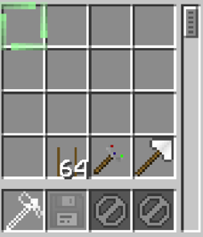
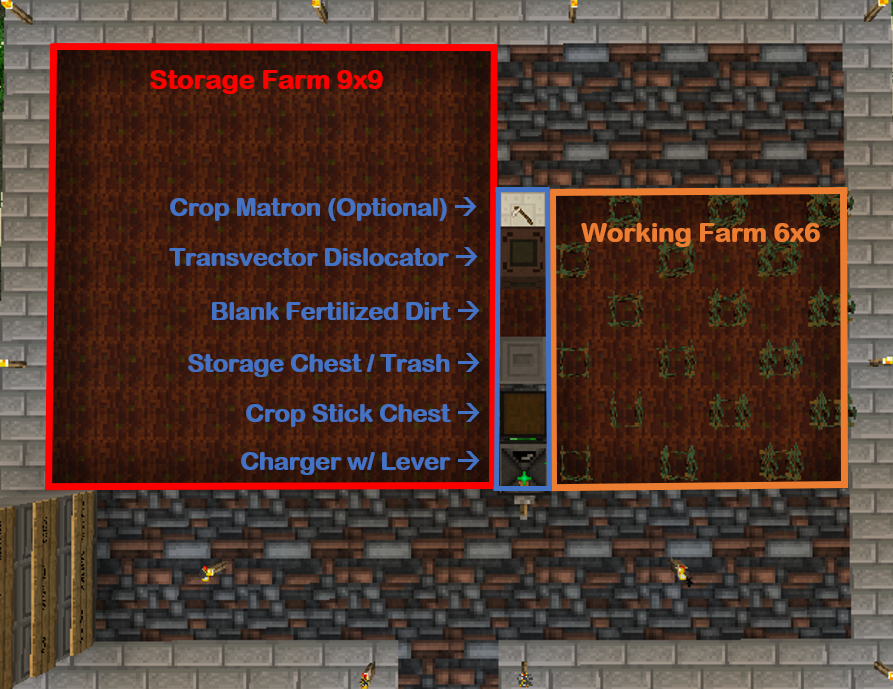

# Introduction

This Open computers (OC) Script will automatically tier up, stat up, and spread (duplicate) crops for you. Open Computers is a very powerful yet complicated mod using custom scripts written in lua, but fear not. I have made everything here as straight forward as possible to help you get your crop bot running in no time.

# Bare Minimum Components

Obtaining these components will require access to EV circuits and epoxid. This is because you need an internet card to pull the scripts from GitHub. Do not waste time trying to write it all yourself. The CPU and Graphics Card can be replaced by a single APU if you feel so inclined. Both inventory upgrades are necessary.

- OC Electronics Assembler
- OC Charger
- Tier 3 Computer Case
- Central Processing Unit (Tier 2)
- Graphics Card (Tier 1)
- Redstone Card (Tier 1)
- Memory (Tier 2)
- EEPROM (Lua BIOS)
- Hard Disk Drive (Tier 1, 1MB)
- Inventory Controller Upgrade
- Inventory Upgrade
- Screen (Tier 1)
- Keyboard
- Geolyzer
- Disk Drive
- Internet Card
- OpenOS (Operating System)

# Building the Robot

1. Insert Computer Case into the OC Electronics Assembler which can be powered directly by GT cables
2. Shift-Click all of the Computer Parts into the Computer Case except the OpenOS
3. Click Assemble and wait until it completes
4. Rename the robot in an anvil
5. Place the robot down on the OC Charger which can also be powered directly by GT cables
6. Insert the OpenOS in the floppy disk slot of the robot and press the power button
7. Follow the commands on the screen "install" --> "Y" --> "Y" (Note: The OpenOS disk is no longer needed in the robot afterwards)
8. Copy the following line of code into the robot (middle-click to paste) and hit enter

        wget https://raw.githubusercontent.com/DylanTaylor1/ic2-crop-automation/main/install.lua

9. Install the rest of the scripts by entering

        ./install

10. To edit the config (not recommended) enter

        edit config.lua

11. Place the Spade and Transvector Binder into the last and second to last slot of the robot, respectively. Crop sticks will go in the third, but it is not required to put them in yourself. See image below.

# Building the Farms

First off, it is recommended to set everything up in a Jungle or Swamp biome at Y=130 as that will give you the highest humidity and air quality stats. This is most easily done in a personal dimension which you earn as a quest reward from reaching the moon. Do not place any solid blocks above the farm as that will reduce the air quality. All of the machines are waterproof (except for power which should be underneath the farm anyway) so do not worry about the rain. Use fertilized dirt or garden soil because they do not require a nearby water source. The whole farm will fit into a single chunk for easy chunk loading. See image below.

First note the orientation of the robot sitting atop the OC charger. It must face up towards the crop stick chest. If the crop stick chest is ever empty, the robot will run into errors and the script will break. In the image, I have a trash can on the other side of the crop stick chest because I currently do not want any drops beyond the target crop, but this can be replaced with another chest if need be. The blank fertilized dirt is for the transvector dislocator which should be facing it. You can tell which direction the transvector dislocator is facing by the side that is animated. The last spot is for a crop-matron which is optional and one y-level lower than the rest of the blocks. It is just to hydrate most of the crops so everything runs a little faster.

The starting crops must be placed manually in the checkerboard pattern seen in the photo. This layout goes for all three programs. If you cannot fill the entire checkerboard to start, the absolute minimum required is two (one as the target crop and the other next to it for crossbreeding). Do not place empty crop sticks to fill the rest of the checkerboard. The target crop is used by autoStat and autoSpread to identify the crop you want to stat-up or spread to the storage farm.

# Running the Programs

The first program is autoTier. This will automatically tier up your crops, terminating once the max breeding round is reached (configurable) or the storge farm is full. A storage chest is recommended for this program. Note that unrecognized crops will be moved to the storage farm first before replacing any of the lower tier crops in the working farm. Statting-up the crops before increasing to the next tier is an option in the config. To run, simply enter:

    autoTier

The second program is autoStat. This will automatically stat up your crops, terminating once Gr + Ga - Re is at least 50 (configurable) for all crops on the working farm. A trash can is recommended for this program. Note that growth is capped at 21 and anything higher will be flagged as a weed. To run, simply enter:

    autoStat

The third program is autoSpread. This will automatically spread (duplicate) your crops if each new Gr + Ga - Re is at least 46 (configurable), terminating once the storage farm is full. A trash can is recommended for this program. Note that growth is capped at 21 and anything higher will be flagged as a weed. To run, simply enter:

    autoSpread

Fire and Forget. If you have brand new crops (ie. 1/1/1 spruce saplings) and want to automatically run autoSpread after autoStat:

    autoStat && autoSpread

## Other Helpful Commands

To list all of the files installed on the robot

    ls

To remove any file installed on the robot

    rm <filename>

To uninstall all of the files from this repo, enter

    uninstall

To run without cleanup for some reason, type ANYTHING after the program name

    autoSpread nocleanup

## Thanks

I DID NOT WRITE MOST OF THE CODE. My repo is a fork from https://github.com/huchenlei/auto-crossbreeding/tree/improve_autocrossbreed which was originally authored by huchenlei and improved by xyqyear. Huge props to them for getting this off the ground and allowing me to take it further.

## Notable Changes

If you are familiar with the older versions of this code (particularly what is currently uploaded to the GTNH wiki) then here are some notable changes that motivated me to develop this fork in the first place.

- Location of the Chests/Dislocator/Crop-Matron now make slightly more sense in my opinion.
- "docleanup" is no longer a flag that needs to be raised. It will do this automatically unless ANY argument is given.
- Running cleanup no longer crashes the robot on any of the programs.
- Running autoStat followed by autoSpread no longer crashes the robot.
- It is no longer necessary to break the robot after the storage farm is full in order to run autoSpread or autoTier again.
- All of the programs run on the same farm layout to facilitate running autoSpread immediately after autoStat.
- Additional functionality such as changing the threshold for autoSpread and autoStat directly from the config and whether or not to stat-up crops while running autoTier.
- Included an uninstall script.
- Code is generally cleaner and more organized with a lot of fluff removed.